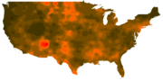

# Plotting maps of Covid 19

Work in progress, please mind the dust.

## About the map style:
* Short form: They're heat maps.  
* Medium form: They're smoothed plots of their specific data sets.
* Long form: The plots are each answering a specific question.  In that sense, they're not automatically heat maps... but most typical uses of those tools produce heat maps.  At present, I don't forsee anything other than heat maps appearing in this project.
In the context of an 'active Covid cases plot', think of these maps as answering the question of "Where are the people who should be aware of or concerned about people in the public being infectious?"
This question is subtly different from "Where are people sick?".  If you look close enough at the county level rendering and the raw data you may be able to spot where the two give different answers, but for a basic, broad-picture view, the answers to the two questions are close enough
that the differences arn't important.  If it's painting an area in red where there arn't infected people, the people in that area are probably concerned about, or directly impacted by the nearest sick populations - either by actively providing support or sheltering indoors to avoid getting caught up.

## How to read the maps:
Unless otherwise noted, brighter colors = higher counts, and the scale used behind the scenes is a variation of the log scale.

Maps in their respective folders will have respective READMEs, consult them for notes on using the maps.

## Defects
Broken borders - The data set has county-level detail, and I don't have a mask of the country's borders to use.  I'm using a naive algorithm to feel out those borders, but it's neither precision nor perfect.  It's doing good work, but a replacement is needed.  Until that happens, if you have your own borders you want to provide, you can strip out the mask I'm using and apply your own.  Details for that are in the README with the maps.

## Todo list:
* Fix holes in the map.  Just having a high res mask of the US using the equirectangular projection would be great, but I may need to just directly mark all the respective regions as "In Bounds" and "Out of Bounds".
* Automate all the things.  I'm lazy, I'd like programs to build and update the maps for me.  That's fine, I'm good at automating things, but like all tasks, automation takes effort, and effort needs time.
* More maps - the point of this project isn't to show the bad in the world, but it had to start somewhere, and a plot of the raw data is an easy starting point.  More maps is where this project will hit its primary goals.  

## Suggestions
I'm open to suggestions, just open issues with them.  If they include reasonable solutions and add true value, there's a better chance of them being implemented.  That said, time is limited, and I have ultimate goals picked out for this project, I may well turn down ideas if they need a lot of effort and don't bring me towards my goals.

## Data Source
https://github.com/datasets/covid-19

## License

Like their data source, these images are licensed under the Open Data Commons [Public Domain and Dedication License][pddl].

[pddl]: https://www.opendatacommons.org/licenses/pddl/1-0/

Basically, as public domain data went into making these, I consider them public domain.  Mentions, while nice, arn't necessary.
The tools that make them however are my private creations and are not being put in the public domain at this time.

## Older work with the same plot style 
http://www.torrenal.com/Census/ - Some of the content here no longer works - YMMV

http://www.torrenal.com/Travian/

