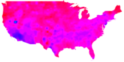
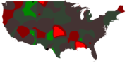
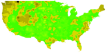

# Plotting maps of Covid 19

Work in progress, please mind the dust.

  

   

## About the map style:
* Short form: They're (mostly) heat maps.  
* Medium form: They're smoothed plots of their specific data sets.
* Long form: The plots are each answering a specific question.  Most typical uses of those tools produce heat maps - for example, if I wanted a proper map of "what kind of iris flower is this?", I'd take the classic iris data set, plot it using this, and then use the colored areas as guides for identifying which flower I had.  "Well, that heigh/width is clearly in the red region, it's setosa.  By rendering thigns as regions rather than points, this declutters the plot, it removes the noise as it were to let you see the signal.  The  naieve coast-finding logic this is using to plot the edges of the US is an application of the same process, and that doesn't present as a heat map.  Using similar logic is the doubling-rates plot.

## How to read the maps:
Notes on how to read the maps are with each plot, basic: Black = no nearby cases, and then typically from dark to light aas counts go up.  The plots working on # of deaths use a variation of the log scale so as not to lose the shape of the data due simply to the scale of the nubmers involved, be they large or small.

Maps in their respective folders will have respective READMEs, consult them for notes on using the maps.

## Todo list:
* Add state outlines.
* Automate all the things.  I'm lazy, I'd like programs to build and update the maps for me.  That's fine, I'm good at automating things, but like all tasks, automation takes effort, and effort needs time.
* More maps - I've got the maps I wanted to make, but that doesn't mean there arn't other, more useful maps  to make.

## Suggestions
I'm open to suggestions, just open issues with them.  If they include reasonable solutions and add true value, there's a better chance of them being implemented.  That said, time is limited, and I have ultimate goals picked out for this project, I may well turn down ideas if they need a lot of effort and don't bring me towards my goals.

## Data Sources
https://github.com/datasets/covid-19 - Covid case data
While it's a handy data set to have, it may not be ideal for production use - they keep making changes to it that upset my own scripts.
  - Used different coordinates for the same points in the deaths and cases files
  - Restructured the data files
  - Stoped updating the master branch.  They now updatet the 'main' branch.  The master branch remains, but has data current as of 12-31-2020.
  T.T

https://www.census.gov - Shapes of places

## License

Like their data source, these images are licensed under the Open Data Commons [Public Domain and Dedication License][pddl].

[pddl]: https://www.opendatacommons.org/licenses/pddl/1-0/

Basically, as public domain data went into making these, I consider them public domain.  Mentions, while nice, arn't necessary.
The tools that make them however are my private creations and are not being put in the public domain at this time.

## Older work with the same plot style 
http://www.torrenal.com/Census/ - Some of the content here no longer works - YMMV

http://www.torrenal.com/Travian/

